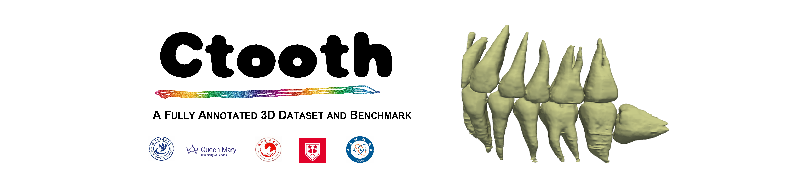

<div align="center">

</div>

[![Contributors][contributors-shield]][contributors-url]
[![Forks][forks-shield]][forks-url]
[![Stargazers][stars-shield]][stars-url]
[![Issues][issues-shield]][issues-url]


We strongly believe this work is a valuable and desired asset to share in public for computer-aided tooth image research. Our goal is to **collect and annotate a 3D tooth dataset, implement an open-source tooth volume segmentation library of state of the art 3D deep neural networks in PyTorch**.    
#### Top priorities 22-07
[Update] This [conference paper](https://arxiv.org/abs/2206.08778) has been accepted on 2022 [ICIRA](https://icira2022.org/camera-ready-submission/).

[Update] We will release our dental dataset **CTooth** and more data samples later in these two months. Please follow us and watch this Github repository for releases to be notified. 


### Datasets 
If you would like to access to the **CTooth** dataset, please send an email guided by **Data_requistion.md** to the [author](acw499@qmul.ac.uk). You will notice our updates via a Wechat group or following our Github account.

## Latest features (06/2022)

- On the fly 3D total volume visualization
- Tensorboard and PyTorch 1.4+ support to track training progress
- Code cleanup and packages creation
- Evaluation visualization


## Support 
If you **really** like this repository and find it useful, please consider (★) **starring** it, so that it can reach a broader audience of like-minded people. It would be highly appreciated :) !

## Contributing to CTooth
If you find a bug, create a GitHub issue, or even better, submit a pull request. Similarly, if you have questions, simply post them as GitHub issues. More info on the [contribute directory](./contribute/readme.md).

## Current team

#### [Qianni Zhang](https://github.com/QNZhang "Git page")

## License , citation and acknowledgements
Please advice the **LICENSE.md** file. For usage of third party libraries and repositories please advise the respective distributed terms. It would be nice to cite the **original models and datasets**. If you want, you can also **cite this work** as:

```
@ARTICLE{2022arXiv220608778C,
       author = {{Cui}, Weiwei and {Wang}, Yaqi and {Zhang}, Qianni and {Zhou}, Huiyu and {Song}, Dan and {Zuo}, Xingyong and {Jia}, Gangyong and {Zeng}, Liaoyuan},
        title = "{CTooth: A Fully Annotated 3D Dataset and Benchmark for Tooth Volume Segmentation on Cone Beam Computed Tomography Images}",
      journal = {arXiv e-prints},
     keywords = {Computer Science - Computer Vision and Pattern Recognition, Computer Science - Artificial Intelligence},
         year = 2022,
        month = jun,
          eid = {arXiv:2206.08778},
        pages = {arXiv:2206.08778},
archivePrefix = {arXiv},
       eprint = {2206.08778},
 primaryClass = {cs.CV},
       adsurl = {https://ui.adsabs.harvard.edu/abs/2022arXiv220608778C},
      adsnote = {Provided by the SAO/NASA Astrophysics Data System}
}

```

####  Acknowledgements
The work was supported by the  National Natural Science Foundation of China under Grant No. U20A20386. Thanks for the data support on the University of Electronic Science and Technology of China and its Hospital.


[contributors-shield]: https://img.shields.io/github/contributors/liangjiubujiu/CTooth.svg?style=flat-square
[contributors-url]: https://github.com/liangjiubujiu/CTooth/graphs/contributors
[forks-shield]: https://img.shields.io/github/forks/liangjiubujiu/CTooth.svg?style=flat-square
[forks-url]: https://github.com/liangjiubujiu/CTooth/network/members

[stars-shield]: https://img.shields.io/github/stars/liangjiubujiu/CTooth.svg?style=flat-square
[stars-url]: https://github.com/liangjiubujiu/CTooth/stargazers

[issues-shield]: https://img.shields.io/github/issues/liangjiubujiu/CTooth.svg?style=flat-square
[issues-url]: https://github.com/liangjiubujiu/CTooth/issues
