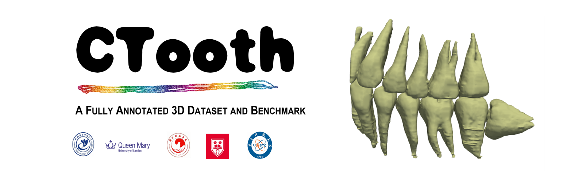

<div align="center">

</div>

[![Contributors][contributors-shield]][contributors-url]
[![Forks][forks-shield]][forks-url]
[![Stargazers][stars-shield]][stars-url]
[![Issues][issues-shield]][issues-url]
<a rel="license" href="http://creativecommons.org/licenses/by/4.0/"></a><br />This work is licensed under a <a rel="license" href="http://creativecommons.org/licenses/by/4.0/">Creative Commons Attribution 4.0 International License</a>.

The gathered data set consists of **5803** CBCT slices in total, out of which **4243**  contain tooth annotations. The images contain significant structural variations in relation to the teeth position, the number of teeth, restorations, implants, appliances,  and the size of jaws.  We strongly believe this work is a valuable and desired asset to share in public for computer-aided tooth image research. Our goal is to **collect and annotate a 3D tooth dataset, implement an open-source tooth volume segmentation library of state of the art 3D deep neural networks in PyTorch**.    

#### Top priorities 23-03
[Update] CTooth dataset has been accepted by the [2023 MICCAI challenge](https://conferences.miccai.org/2023/en/). Please wait for the official channels of data download and result submission. 

#### Top priorities 22-10
[Update] As this dataset requires more annotation refinement, we will temporarily close the download link until we are ready to release it.  I appreciate your patience while we prepare.  You will be added to the waiting list once you send an email requesting data. 

[Update] More details can be found on [Kaggle](https://www.kaggle.com/datasets/weiweicui/ctooth-dataset). 

#### Top priorities 22-07

[Update] This conference paper [CTooth+](https://arxiv.org/abs/2208.01643) has been accepted on 2022 [MICCAI WORKSHOP DALI](https://dali-miccai.github.io/).

[Update] This conference paper [CTooth](https://arxiv.org/abs/2206.08778) has been accepted on 2022 [ICIRA](https://icira2022.org/camera-ready-submission/).

[Update] We will release our dental dataset **CTooth** and more data samples later in these two months. Please follow us and watch this Github repository for releases to be notified. 


## Dataset Requisition
~~Please send an email to acw499@qmul.ac.uk requesting access to the CTooth dataset after reading the **[Data_requisition.md](https://github.com/liangjiubujiu/CTooth/blob/main/Data_requistion.md)**. Our updates will be announced later on a Wechat group or via our Github account.~~
Please keep an eye out for the latest notices from the [MICCAI 2023](https://conferences.miccai.org/2023/en/). We will record all the emails for dataset requisition and reopen the dataset release with email after the 2023 MICCAI challenge.

## Benchmark
Please see the attention based tooth segmentation benckmark [here](./benchmark/readme.md)

## Latest features (07/2022)

- On the fly 3D total volume visualization
- Tensorboard and PyTorch 1.4+ support to track training progress
- Code cleanup and packages creation
- Evaluation visualization


## Support 
If you **really** like this repository and find it useful, please consider (★) **starring** it, so that it can reach a broader audience of like-minded people. It would be highly appreciated :) !

## Contributing to CTooth
If you find a bug, create a GitHub issue, or even better, submit a pull request. Similarly, if you have questions, simply post them as GitHub issues. More info on the [contribute directory](./contribute/readme.md).

## Current team

#### [Qianni Zhang](https://github.com/QNZhang "Git page")

## License , citation and acknowledgements
Please advice the **LICENSE.md** file. For usage of third party libraries and repositories please advise the respective distributed terms. It would be nice to cite the **original models and datasets**. If you want, you can also **cite this work** as:

```

@inproceedings{Cui2022CToothAF,
  title={CTooth: A Fully Annotated 3D Dataset and Benchmark for Tooth Volume Segmentation on Cone Beam Computed Tomography Images},
  author={Weiwei Cui and Yaqi Wang and Qianni Zhang and Huiyu Zhou and Dansheg Song and Xingyong Zuo and Gangyong Jia and Liaoyuan Zeng},
  booktitle={ICIRA},
  year={2022}
}

@inproceedings{Cui2022CToothAL,
  title={CTooth+: A Large-scale Dental Cone Beam Computed Tomography Dataset and Benchmark for Tooth Volume Segmentation},
  author={Weiwei Cui and Yaqi Wang and Yilong Li and Dansheg Song and Xingyong Zuo and Jiaojiao Wang and Yifan Zhang and Huiyu Zhou and Bun San Chong and Liaoyuan Zeng and Qianni Zhang},
  booktitle={DALI@MICCAI},
  year={2022}
}

```

####  Acknowledgements
The work was supported by the  National Natural Science Foundation of China under Grant No. U20A20386. Thanks for the data support on the University of Electronic Science and Technology of China and its Hospital.


[contributors-shield]: https://img.shields.io/github/contributors/liangjiubujiu/CTooth.svg?style=flat-square
[contributors-url]: https://github.com/liangjiubujiu/CTooth/graphs/contributors
[forks-shield]: https://img.shields.io/github/forks/liangjiubujiu/CTooth.svg?style=flat-square
[forks-url]: https://github.com/liangjiubujiu/CTooth/network/members

[stars-shield]: https://img.shields.io/github/stars/liangjiubujiu/CTooth.svg?style=flat-square
[stars-url]: https://github.com/liangjiubujiu/CTooth/stargazers

[issues-shield]: https://img.shields.io/github/issues/liangjiubujiu/CTooth.svg?style=flat-square
[issues-url]: https://github.com/liangjiubujiu/CTooth/issues
